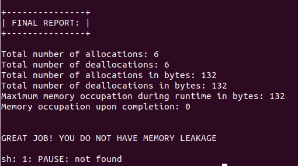

# Cpp-Garbage-Collector

Implement a smart pointer, which is actually using **Reference Counting** garbage collector.
Building this project will help understand both how to work with pointers and references, and also why smart pointers are so important to modern C++ programming. 

## Result

